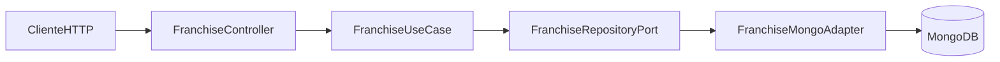

# API de Franquicias (Spring Boot Reactivo)

Solucion backend para gestionar franquicias, sucursales y productos con enfoque en:

- Programacion reactiva con Spring WebFlux.
- Persistencia reactiva con MongoDB.
- Clean Architecture.
- Pruebas unitarias.
- Contenerizacion con Docker.
- Infrastructure as Code con Terraform (AWS).

## 1) Requisitos

- Java 17+
- Maven 3.9+
- Docker y Docker Compose
- (Opcional) Terraform 1.6+ y cuenta AWS

## 2) Arquitectura (Clean Architecture)

Capas implementadas:

- `domain`: entidades y reglas de negocio puras.
- `application`: puertos y casos de uso.
- `infrastructure`: controladores HTTP, adaptadores de persistencia MongoDB, DTOs y mapeadores.
- `config/bootstrap`: arranque de Spring Boot.

Estructura:

- `src/main/java/com/prueba/franquicias/domain`
- `src/main/java/com/prueba/franquicias/application`
- `src/main/java/com/prueba/franquicias/infrastructure`

Flujo:



## 3) Endpoints implementados

Base URL: `http://localhost:8080/api/franchises`

### Obligatorios

1. Crear franquicia
- `POST /`

2. Agregar sucursal a franquicia
- `POST /{franchiseId}/branches`

3. Agregar producto a sucursal
- `POST /{franchiseId}/branches/{branchId}/products`

4. Eliminar producto de sucursal
- `DELETE /{franchiseId}/branches/{branchId}/products/{productId}`

5. Modificar stock de producto
- `PATCH /{franchiseId}/branches/{branchId}/products/{productId}/stock`

6. Obtener producto con mayor stock por sucursal de una franquicia
- `GET /{franchiseId}/top-stock-products`

### Plus implementados

- Actualizar nombre de franquicia: `PATCH /{franchiseId}/name`
- Actualizar nombre de sucursal: `PATCH /{franchiseId}/branches/{branchId}/name`
- Actualizar nombre de producto: `PATCH /{franchiseId}/branches/{branchId}/products/{productId}/name`

## 4) Ejecucion local (sin Docker)

1. Levantar MongoDB local (por ejemplo en `mongodb://localhost:27017`).
2. Ejecutar:

```bash
mvn spring-boot:run
```

Variable opcional:

- `MONGODB_URI` (default: `mongodb://localhost:27017/franchise_db`)

## 5) Ejecucion con Docker

```bash
docker compose up --build
```

Esto levanta:

- API en `http://localhost:8080`
- MongoDB en `localhost:27017`

## 6) Pruebas unitarias

```bash
mvn test
```

Incluye:

- Tests de casos de uso reactivos.
- Tests de controlador con `WebTestClient`.
- Reporte Jacoco en `target/site/jacoco/index.html`.

## 7) Ejemplos de uso (curl)

Crear franquicia:

```bash
curl -X POST http://localhost:8080/api/franchises \
  -H "Content-Type: application/json" \
  -d '{"name":"Franquicia Centro"}'
```

Agregar sucursal:

```bash
curl -X POST http://localhost:8080/api/franchises/{franchiseId}/branches \
  -H "Content-Type: application/json" \
  -d '{"name":"Sucursal Norte"}'
```

Agregar producto:

```bash
curl -X POST http://localhost:8080/api/franchises/{franchiseId}/branches/{branchId}/products \
  -H "Content-Type: application/json" \
  -d '{"name":"Teclado","stock":42}'
```

Actualizar stock:

```bash
curl -X PATCH http://localhost:8080/api/franchises/{franchiseId}/branches/{branchId}/products/{productId}/stock \
  -H "Content-Type: application/json" \
  -d '{"stock":90}'
```

Eliminar producto:

```bash
curl -X DELETE http://localhost:8080/api/franchises/{franchiseId}/branches/{branchId}/products/{productId}
```

Top productos por sucursal:

```bash
curl http://localhost:8080/api/franchises/{franchiseId}/top-stock-products
```

## 8) IaC con Terraform (AWS)

Ruta: `infra/terraform`

Recursos principales:

- ECR (repositorio de imagen)
- ECS Fargate (ejecucion contenedor)
- ALB (exposicion HTTP)
- CloudWatch Logs
- Opcion para aprovisionar DocumentDB (`provision_documentdb = true`)

### Pasos

1. Crear archivo de variables:

```bash
cd infra/terraform
cp terraform.tfvars.example terraform.tfvars
```

2. Ajustar `terraform.tfvars`:
- `aws_region`
- `container_image` (o usar ECR creado)
- `mongodb_uri` o habilitar `provision_documentdb = true`

3. Inicializar y aplicar:

```bash
terraform init
terraform plan
terraform apply
```

4. Obtener URL publica:

```bash
terraform output alb_dns_name
```

## 9) Criterios de evaluacion cubiertos

- Spring Boot: si.
- Programacion reactiva: si (WebFlux + repositorio reactivo).
- Persistencia: si (MongoDB).
- Unit tests: si.
- Docker: si.
- IaC: si (Terraform AWS).
- Clean Architecture: si.
- Buenas practicas: capas separadas, DTOs, mapeadores, validacion y manejo centralizado de errores.


55XZ3VGGJPj0